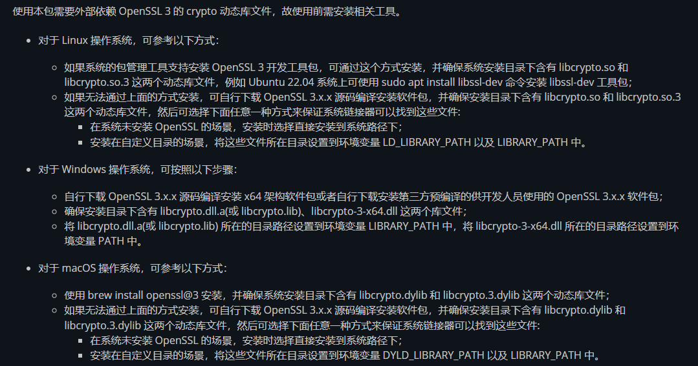

<div align="center">
<h1>mysql-driver</h1>
</div>


<p align="center">


</p>

##  1 介绍

### 1.1 项目特性

mysql-driver是使用Cangjie编写的mysql原生驱动程序，基于mysql客户端协议。同时适配TIDB、OceanBase等国产数据库。

##  2 架构

### 2.1 项目结构

```shell
├── doc
    └── readme-image
└── src
    ├── cdbc 		//cdbc接口实现
    ├── connection 	//驱动内部使用的mysql连接对象
    ├── protocol 	//对协议的封装
    ├── result 		//对结果集的封装
    ├── test 		//测试
    └── xa          //xa协议实现
├── CHANGELOG
├── cjpm.lock
├── cjpm.toml
├── LICENSE
├── README.md
```

### 2.2 接口说明

> 参考仓颉官方的数据库接口文档

##  3 使用说明

> 仓颉提供的摘要算法和加密算法依赖OpenSSL3的crypto 动态库文件, 因此使用该驱动时需要确保本地环境有相应的动态库文件。
>
> windows openSSL预编译包下载 -> https://slproweb.com/products/Win32OpenSSL.html



### 3.1 编译构建（Win/Linux/Mac）

cjpm.toml文件添加以下配置后，再执行cjpm update，即可在项目中引入mysql-driver。

```toml
[dependencies]
  mysql-driver = {git = "https://gitcode.com/weixin_64400442/mysql-driver.git", branch="master"}
```

### 3.2 功能示例

```sql
CREATE TABLE `simple` (
`id` int NOT NULL AUTO_INCREMENT,
`varchar_col` varchar(255) DEFAULT NULL,
`int_col` int DEFAULT NULL,
`double_col` double(10,4) DEFAULT NULL,
`decimal_col` decimal(10,5) DEFAULT NULL,
`date_col` date DEFAULT NULL,
`time_col` time DEFAULT NULL,
`datetime_col` datetime DEFAULT NULL,
PRIMARY KEY (`id`)
) 
```

####  查询数据(Query)

```cangjie
import std.database.sql.*
import mysql.cdbc.*

main(): Unit {
  
    var driver = DriverManager.getDriver("mysql").getOrThrow()
    var property1 = ("username", "root")
    var property2 = ("password", "MySql123!")
    var property3 = ("database", "driver_test")
    //var property4 = ("prepare.mode", "server")
    var dataSource = driver.open("mysql://localhost", [property1, property2, property3])
    var connection = dataSource.connect()

    var statemnt = connection.prepareStatement("select * from simple")
	//statemnt.setOption("fetchSize", "10") //支持设置fetchSize, 使用该选项时需要确保prepare.mode设置为server
    var id = SqlBigInt(0)
    var varchar = SqlNullableChar(None)
    var int = SqlNullableInteger(None)
    var double = SqlNullableDouble(None)
    var deciaml = SqlNullableDecimal(None)
    var date = SqlNullableDate(None)
    var time = SqlNullableTime(None)
    var datetime = SqlNullableTimestamp(None)
    var result = statemnt.query()
    while (result.next([id, varchar, int, double, deciaml, date, time, datetime])) {
        println("${id.value} ${varchar.value} ${double.value} ${deciaml.value} ${date.value} ${time.value} ${datetime.value}")
    }
}
```

#### 更新数据(Insert、Update、Delete)

```cangjie
import std.database.sql.*
import mysql.cdbc.*
import std.time.DateTime
import std.math.numeric.Decimal

main(): Unit {
  
    var driver = DriverManager.getDriver("mysql").getOrThrow()
    var property1 = ("username", "root")
    var property2 = ("password", "MySql123!")
    var property3 = ("database", "driver_test")
    var dataSource = driver.open("mysql://localhost", [property1, property2, property3])
    var connection = dataSource.connect()

    var statemnt = connection.prepareStatement("insert into simple values (?, ?, ?, ?, ?, ?, ?, ?)")
    var id = SqlBigInt(666)
    var varchar = SqlNullableChar("MySql")
    var int = SqlNullableInteger(None)
    var double = SqlNullableDouble(123.456789)
    var deciaml = SqlNullableDecimal(Decimal("1.234567"))
    var date = SqlNullableDate(DateTime.now())
    var time = SqlNullableTime(DateTime.now())
    var datetime = SqlNullableTimestamp(None)
    var result = statemnt.update([id, varchar, int, double, deciaml, date, time, datetime])

    println("effect row: ${result.rowCount} lastInsertId: ${result.lastInsertId}")
  
}
```

#### 获取事务对象

```cangjie
import mysql.cdbc.*
import std.database.sql.*

main(){
    var driver = DriverManager.getDriver("mysql").getOrThrow()
    var property1 = ("username" "root")
    var property2 = ("password", "MySql123!")
    var property3 = ("database", "test")
    var dataSource = driver.open("mysql://localhost:3306", [property1,property2,property3])
    var connection =  dataSource.connect()
    var transaction = connection.createTransaction()
    transaction.begin()
    transaction.commit()
}
```


## 3.3 连接参数

| 选项名                  | 功能                                                                     | 可选值                                                     | 默认值    | Require                           |
| ----------------------- | ------------------------------------------------------------------------ | ---------------------------------------------------------- | --------- | --------------------------------- |
| username                | 数据库用户名                                                             |                                                            |           | Yes                               |
| password                | 数据库密码                                                               |                                                            |           | Yes                               |
| host                    | 主机地址                                                                 |                                                            |           | Yes                               |
| port                    | 服务端口                                                                 |                                                            | 3306      | No                                |
| database                | 数据库                                                                   |                                                            |           | No                                |
| connection_timeout      | connect 操作的超时时间，单位 ms。                                        |                                                            |           | No                                |
| query_timeout           | query 操作的超时时间，单位 ms。                                          |                                                            |           | No                                |
| update_timeout          | update 操作的超时时间，单位 ms。                                         |                                                            |           | No                                |
| encoding                | 数据库字符集编码类型。当前仅支持UTF-8                                    |                                                            | utf-8     | No                                |
| ssl.mode                | 传输层加密模式。                                                         | disabled,preferred(default),required,verify_ca,verify_full | preferred | No                                |
| ssl.ca                  | 证书颁发机构（ CA ）证书文件的路径名                                     |                                                            |           | No                                |
| ssl.cert                | 客户端 SSL 公钥证书文件的路径名。                                        |                                                            |           | No                                |
| ssl.key                 | 客户端 SSL 私钥文件的路径名。                                            |                                                            |           | 使用了ssl.cert必须指定ssl.key参数 |
| ssl.key.password        | 客户端 SSL 私钥文件的密码。                                              |                                                            |           | No                                |
| ssl.sni                 | 客户端通过该标识在握手过程开始时试图连接到哪个主机名。                   |                                                            |           | No                                |
| tls1.2.ciphersuites     | 此选项指定客户端允许使用 TLSv1.2 及以下的加密连接使用哪些密码套件。      |                                                            |           | No                                |
| tls1.3.ciphersuites     | 此选项指定客户端允许使用 TLSv1.3 的加密连接使用哪些密码套件。            |                                                            |           | No                                |
| tls.version             | 支持的 TLS 版本号，值为逗号分隔的字符串，比如 "TLSv1.2,TLSv1.3"。        |                                                            |           | No                                |
| pool.connection_timeout | 从池中获取连接的超时时间。单位 s                                         |                                                            | 30        | No                                |
| pool.idle_timeout       | 允许连接在池中闲置的最长时间，超过这个时间的空闲连接可能会被回收。单位 m |                                                            | 10        | No                                |
| pool.keepalive_time     | 检查空闲连接健康状况的间隔时间，防止它被数据库或网络基础设施超时。单位 m |                                                            | 1         | No                                |
| pool.max_idle_size      | 最大空闲连接数量，超过这个数量的空闲连接会被关闭，负数或0表示无限制。    |                                                            | 0         | No                                |
| pool.max_life_time      | 自连接创建以来的持续时间，在该持续时间之后，连接将自动关闭。单位 m       |                                                            | 30        | No                                |
| pool.max_size           | 连接池最大连接数量，负数或0表示无限制。                                  |                                                            | 10        | No                                |
| prepare.mode            | 预编译模式                                                               | auto: 自动选择, server: 服务端预编译                       | client    | No                                |

### 3.4目前已知的一些问题

##  4 参与贡献

本项目由Yesokim实现并维护。技术支持和意见反馈请提Issue。

本项目基于 Apache License 2.0，欢迎给我们提交PR，欢迎参与任何形式的贡献。

本项目commiter：[@Yesokim](https://gitcode.com/weixin_64400442)
