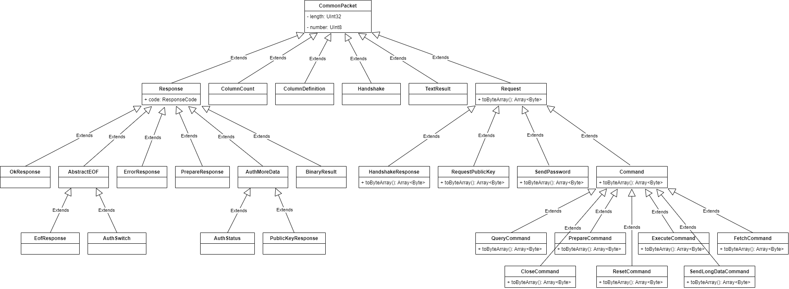

<div align="center">
<h1>Cangjie MySql Driver</h1>
</div>

<p align="center">


</p>

##  1 介绍

### 1.1 项目特性

Cangjie MySql Driver是为Cangjie编程语言提供MySql原生驱动程序,基于MySql协议. 同时适配TIDB等国产数据库

##  2 架构

### 2.1 项目结构

```shell
.
├── doc
    └── readme-image
└── src
    ├── cdbc
    ├── connection 
    ├── jdbc
    ├── protocol 
    ├── result
    └── test
├── CHANGELOG
├── cjpm.lock
├── cjpm.toml
├── LICENSE
├── README.md
```



### 2.2 接口说明

##  3 使用说明

> 仓颉提供的摘要算法和加密算法依赖 OpenSSL 3 的 crypto 动态库文件,因此使用本驱动时需要确保当前环境的OpenSSL版本为3.x

### 3.1 编译构建（Win/Linux/Mac）

```toml
[dependencies]
  cjmd = {git = "https://gitcode.com/weixin_64400442/cjmd.git", branch="master", version = "1.0.0"}
```

### 3.2 功能示例

```sql
CREATE TABLE `test` (
`id` int NOT NULL AUTO_INCREMENT,
`varchar_col` varchar(255) DEFAULT NULL,
`char_col` char(10) DEFAULT NULL,
`tinyint_col` tinyint DEFAULT NULL,
`smallint_col` smallint DEFAULT NULL,
`mediumint_col` mediumint DEFAULT NULL,
`int_col` int DEFAULT NULL,
`bigint_col` bigint DEFAULT NULL,
`float_col` float(8,2) DEFAULT NULL,
`double_col` double(10,4) DEFAULT NULL,
`decimal_col` decimal(10,5) DEFAULT NULL,
`date_col` date DEFAULT NULL,
`datetime_col` datetime DEFAULT NULL,
`timestamp_col` timestamp NULL DEFAULT NULL,
`time_col` time DEFAULT NULL,
`year_col` year DEFAULT NULL,
PRIMARY KEY (`id`)
) ENGINE=InnoDB AUTO_INCREMENT=20 DEFAULT CHARSET=utf8mb4 COLLATE=utf8mb4_0900_ai_ci;
```

#### 3.2.1 官方数据库接口

##### 获取连接

```cangjie
import std.database.sql.*
import cjmd.cdbc.*

main(){
    var driver = DriverManager.getDriver("mysql").getOrThrow()
    var property1 = ("username", "root")
    var property2 = ("password", "MySql123!")
    var property3 = ("database", "test")
    var dataSource = driver.open("mysql://localhost:3306", [property1,property2,property3])
    var connection =  dataSource.connect()
}
```

##### 插入数据

```
import cjmd.cdbc.*
import std.database.sql.*
import std.time.DateTime

main(){
    var driver = DriverManager.getDriver("mysql").getOrThrow()
    var property1 = ("username" "root")
    var property2 = ("password", "MySql123!")
    var property3 = ("database", "test")
    var dataSource = driver.open("mysql://localhost:3306", [property1,property2,property3])
    var connection =  dataSource.connect()
    var prepare = connection.prepareStatement("insert into test (varchar_col, char_col, tinyint_col, smallint_col, mediumint_col,    int_col, bigint_col, float_col, double_col, decimal_col, date_col, datetime_col, timestamp_col, time_col, year_col) values(?,?,?,?,?,?,?,?,?,?,?,?,?,?,?)")
    var param1 = SqlVarchar("varchar")
    var param2 = SqlChar("char")
    var param3 = SqlByte(8)
    var param4 = SqlSmallInt(16)
    var param5 = SqlInteger(24)
    var param6 = SqlInteger(32)
    var param7 = SqlBigInt(64)
    var param8 = SqlReal(30.45780)
    var param9 = SqlDouble(30.234)
    var param10 = SqlDouble(30.823567543567)
    var param11 = SqlDate(DateTime.now())
    var param12 = SqlTimestamp(DateTime.now())
    var param13 = SqlTimestamp(DateTime.now())
    var param14 = SqlTime(DateTime.now())
    var param15 = SqlSmallInt(2024)
    var result = prepare.update([param1,param2,param3,param4,param5,param6,param7,param8,param9,param10,param11,param12,param13,param14,param15])
    println("effect rows: ${result.rowCount}")
    println("last insert id: ${result.lastInsertId}")
}
```

##### 查询数据

```
import cjmd.cdbc.*
import std.database.sql.*

main(){
    var driver = DriverManager.getDriver("mysql").getOrThrow()
    var property1 = ("username" "root")
    var property2 = ("password", "MySql123!")
    var property3 = ("database", "test")
    var dataSource = driver.open("mysql://localhost:3306", [property1,property2,property3])
    var connection =  dataSource.connect()
  
    var prepare = connection.prepareStatement("select * from test")

    var id = SqlInteger(-1)
    var col1 = SqlNullableVarchar(None)
    var col2 = SqlNullableChar(None)
    var col3 = SqlNullableByte(None)
    var col4 = SqlNullableSmallInt(None)
    var col5 = SqlNullableInteger(None)

    var row: Array<SqlDbType> = [id,col1,col2,col3,col4,col5]

    var result = prepare.query()
    while (result.next(row)) {
            println("${id.value} ${col1.value} ${col2.value} ${col3.value} ${col4.value} ${col5.value}")
    }

}
```

##### 获取事务对象

```
import cjmd.cdbc.*
import std.database.sql.*

main(){
    var driver = DriverManager.getDriver("mysql").getOrThrow()
    var property1 = ("username" "root")
    var property2 = ("password", "MySql123!")
    var property3 = ("database", "test")
    var dataSource = driver.open("mysql://localhost:3306", [property1,property2,property3])
    var connection =  dataSource.connect()
    var transaction = connection.createTransaction()
    transaction.begin()
    transaction.commit()
}
```

#### 3.2.2 类JDBC接口

##### 插入数据

```
import cjmd.jdbc.*
import cjmd.jdbc.impl.*

import std.time.*
import std.math.numeric.*
import std.io.*
import std.fs.*
import encoding.json.*

main() {
    var driver = DriverManager.getDriver("mysql").getOrThrow()
    var property1 = ("username", "root")
    var property2 = ("password", "MySql123!")
    var property3 = ("database", "driver_test")
    var dataSource = driver.open("mysql://localhost:3306", [property1,property2,property3])
    var connection =  dataSource.connect()
      var sql = ###"insert into full_test (
                                tinyint_col,
                                utinyint_col,
                                smallint_col,
                                usmallint_col,
                                mediumint_col,
                                umediumint_col,
                                int_col,
                                uint_col,
                                bigint_col,
                                ubigint_col,
                                float_col,
                                double_col,
                                decimal_col,
                                date_col, 
                                time_col, 
                                datetime_col,
                                timestamp_col, 
                                year_col,
                                char_col,
                                varchar_col,
                                tinytext_col,
                                text_col,
                                mediumtext_col,
                                longtext_col,
                                tinyblob_col,
                                blob_col,
                                mediumblob_col,
                                longblob_col,
                                json_col,
                                set_col,
                                enum_col) 
                                values
                                (?,?,?,?,?,?,?,?,?,?,?,?,?,?,?,?,?,?,?,?,?,?,?,?,?,?,?,?,?,?,?)"###
        var prepare = connection.prepareStatement(sql)
        //tinyint
        prepare.setInt8(1, -128)
        //utinyint
        prepare.setUInt8(2, 0)
        //smallint
        prepare.setInt16(3, -32768)
        //usmallint
        prepare.setUInt16(4, 0)
        //mediumint
        prepare.setInt32(5, -8388608)
        //umediumint
        prepare.setUInt32(6, 0)
        //int
        prepare.setInt32(7, -2147483648)
        //uint
        prepare.setUInt32(8, 0)
        //bigint
        prepare.setInt64(9, -9223372036854775808)
        //ubigint
        prepare.setUInt64(10, 0)
        //float
        prepare.setFloat32(11, -1230.456)
        //double
        prepare.setFloat64(12, -234.568978)
        //decimal
        prepare.setDecimal(13, Decimal("1234.56789"))
        //date
        prepare.setDate(14, Date(DateTime.now()))
        //time
        prepare.setTime(15, Time(DateTime.now()))
        //datetime
        prepare.setDateTime(16, DateTime.now()) 
        //timestamp
        prepare.setDateTime(17, DateTime.now()) 
        //year
        prepare.setInt16(18, 2077)
        //char
        prepare.setString(19, "我冒了严寒，回到相隔二千余里，别了二十余年的故乡去。")
        //varchar
        prepare.setString(20, "时候既然是深冬；渐近故乡时，天气又阴晦了，冷风吹进船舱中")
        //tiny_text
        prepare.setString(21, "于是我自己解释说：故乡本也如此，——虽然没有进步，也未必有如我所感的悲凉")
        //text
        prepare.setString(22, "我所记得的故乡全不如此。我的故乡好得多了。但要我记起他的美丽，说出他的佳处来，却又没有影像，没有言辞了。仿佛也就如此。")
        //mediutext
        prepare.setString(23, "但我们终于谈到搬家的事。我说外间的寓所已经租定了，又买了几件家具，此外须将家里所有的木器卖去，再去增添。母亲也说好，而且行李也略已齐集，木器不便搬运的，也小半卖去了，只是收不起钱来。\r\n\r\n“你休息一两天，去拜望亲戚本家一回，我们便可以走了。”母亲说。\r\n\r\n“是的。”\r\n\r\n“还有闰土，他每到我家来时，总问起你，很想见你一回面。我已经将你到家的大约日期通知他，他也许就要来了。”\r\n\r\n这时候，我的脑里忽然闪出一幅神异的图画来：深蓝的天空中挂着一轮金黄的圆月，下面是海边的沙地，都种着一望无际的碧绿的西瓜，其间有一个十一二岁的少年，项带银圈，手捏一柄钢叉，向一匹猹⑵尽力的刺去，那猹却将身一扭，反从他的胯下逃走了。")
        //longtext
        prepare.setString(24, "这少年便是闰土。我认识他时，也不过十多岁，离现在将有三十年了；那时我的父亲还在世，家景也好，我正是一个少爷。那一年，我家是一件大祭祀的值年⑶。这祭祀，说是三十多年才能轮到一回，所以很郑重；正月里供祖像，供品很多，祭器很讲究，拜的人也很多，祭器也很要防偷去。我家只有一个忙月（我们这里给人做工的分三种：整年给一定人家做工的叫长工；按日给人做工的叫短工；自己也种地，只在过年过节以及收租时候来给一定人家做工的称忙月），忙不过来，他便对父亲说，可以叫他的儿子闰土来管祭器的。\r\n\r\n我的父亲允许了；我也很高兴，因为我早听到闰土这名字，而且知道他和我仿佛年纪，闰月生的，五行缺土⑷，所以他的父亲叫他闰土。他是能装〔弓京〕捉小鸟雀的。\r\n\r\n我于是日日盼望新年，新年到，闰土也就到了。好容易")
        //tinyblob
        var stream = ByteArrayStream()
        stream.write([])
        prepare.setInputStream(25, stream)
        //blob
        var bytes: Array<Byte> = [145,67,34,12,45,32,76,90,62,145,24,56,234,34,235,56,67,145,67,34,12,45,32,76,90,62,145,24,56,234,34,235,56,67,145,67,34,12,45,32,76,90,62,145,24,56,234,34,235,56,67,145,67,34,12,45,32,76,90,62,145,24,56,234,34,235,56,67]
        prepare.setArray(26, bytes)
        //mediumblob
        stream = ByteArrayStream()
        stream.write([145,67,34,12,45,32,76,90,62,145,24,56,234,34,235,56,67,145,67,34,12,45,32,76,90,62,145,24,56,234,34,235,56,67,145,67,34,12,45,32,76,90,62,145,24,56,234,34,235,56,67,145,67,34,12,45,32,76,90,62,145,24,56,234,34,235,56,67])
        prepare.setInputStream(27, stream)
        //longblob
        var file = File("C:\\Users\\30247\\Desktop\\cjmd\\doc\\1.jpg",  OpenOption.Open(true, true))
        var array = file.readToEnd()
        var image = ByteArrayStream()
        image.write(array)
        prepare.setInputStream(28, image)
        //json
        var json = JsonObject.fromStr('{"name":"yesokim", "age": 22, "sex": 1}')
        prepare.setJson(29, json)
        //set
        prepare.setString(30, "value1,value2")
        //enum
        prepare.setString(31, "value1")
        var result = prepare.update()
        println("effect rows: ${result.effectRow}")
        println("last insert id: ${result.lastInsertId}")
        prepare.close()
}
```

##### 查询数据

```
import cjmd.jdbc.*
import cjmd.jdbc.impl.*

import std.time.*
import std.math.numeric.*
import std.io.*
import std.fs.*
import encoding.json.*

main() {
    var driver = DriverManager.getDriver("mysql").getOrThrow()
    var property1 = ("username", "root")
    var property2 = ("password", "MySql123!")
    var property3 = ("database", "driver_test")
    var dataSource = driver.open("mysql://localhost:3306", [property1,property2,property3])
    var connection =  dataSource.connect()
    var prepare = connection.prepareStatement("select * from full_test where id = ?")
    var result = prepare.query([199])
        while (result.next()) {
            println(result.getInt64(1))
            println(result.getInt8(2))
            println(result.getUInt8(3))
            println(result.getInt16(4))
            println(result.getUInt16(5))
            println(result.getInt32(6))
            println(result.getUInt32(7))
            println(result.getInt32(8))
            println(result.getUInt32(9))
            println(result.getInt64(10))
            println(result.getUInt64(11))
            println(result.getFloat32(12))
            println(result.getFloat64(13))
            println(result.getDecimal(14))
            println(result.getDate(15))
            println(result.getTime(16))
            println(result.getDateTime(17))
            println(result.getDateTime(18))
            println(result.getInt16(19))

            println(result.getString(20))
            println(result.getString(21))
            println(result.getString(22))
            println(result.getString(23))
            println(result.getString(24))
            println(result.getString(25))
            println(result.getArray(26))
            println(result.getArray(27))
            println(result.getArray(28))
            //println(result.getArray(29))
            println(result.getJsonValue(30))
            println(result.getString(31))
            println(result.getString(32))
        }
}
```

## 3.3 连接参数


| 选项名                  | 功能                                                                     | 可选值                                                     | 默认值    | Require                           |
| ----------------------- | ------------------------------------------------------------------------ | ---------------------------------------------------------- | --------- | --------------------------------- |
| username                | 数据库用户名                                                             |                                                            |           | Yes                               |
| password                | 数据库密码                                                               |                                                            |           | Yes                               |
| host                    | 主机地址                                                                 |                                                            |           | Yes                               |
| port                    | 服务端口                                                                 |                                                            | 3306      | No                                |
| database                | 数据库                                                                   |                                                            |           | No                                |
| connection_timeout      | connect 操作的超时时间，单位 ms。                                        |                                                            |           | No                                |
| query_timeout           | query 操作的超时时间，单位 ms。                                          |                                                            |           | No                                |
| update_timeout          | update 操作的超时时间，单位 ms。                                         |                                                            |           | No                                |
| encoding                | 数据库字符集编码类型。当前仅支持UTF-8                                    |                                                            | utf-8     | No                                |
| ssl.mode                | 传输层加密模式。                                                         | disabled,preferred(default),required,verify_ca,verify_full | preferred | No                                |
| ssl.ca                  | 证书颁发机构（ CA ）证书文件的路径名                                     |                                                            |           | No                                |
| ssl.cert                | 客户端 SSL 公钥证书文件的路径名。                                        |                                                            |           | No                                |
| ssl.key                 | 客户端 SSL 私钥文件的路径名。                                            |                                                            |           | 使用了ssl.cert必须指定ssl.key参数 |
| ssl.key.password        | 客户端 SSL 私钥文件的密码。                                              |                                                            |           | No                                |
| ssl.sni                 | 客户端通过该标识在握手过程开始时试图连接到哪个主机名。                   |                                                            |           | No                                |
| tls1.2.ciphersuites     | 此选项指定客户端允许使用 TLSv1.2 及以下的加密连接使用哪些密码套件。      |                                                            |           | No                                |
| tls1.3.ciphersuites     | 此选项指定客户端允许使用 TLSv1.3 的加密连接使用哪些密码套件。            |                                                            |           | No                                |
| tls.version             | 支持的 TLS 版本号，值为逗号分隔的字符串，比如 "TLSv1.2,TLSv1.3"。        |                                                            |           | No                                |
| pool.connection_timeout | 从池中获取连接的超时时间。单位 s                                         |                                                            | 30        | No                                |
| pool.idle_timeout       | 允许连接在池中闲置的最长时间，超过这个时间的空闲连接可能会被回收。单位 m |                                                            | 10        | No                                |
| pool.keepalive_time     | 检查空闲连接健康状况的间隔时间，防止它被数据库或网络基础设施超时。单位 m |                                                            | 1         | No                                |
| pool.max_idle_size      | 最大空闲连接数量，超过这个数量的空闲连接会被关闭，负数或0表示无限制。    |                                                            | 0         | No                                |
| pool.max_life_time      | 自连接创建以来的持续时间，在该持续时间之后，连接将自动关闭。单位 m       |                                                            | 30        | No                                |
| pool.max_size           | 连接池最大连接数量，负数或0表示无限制。                                  |                                                            | 10        | No                                |
| prepare.mode            | 预编译模式                                                               | auto: 自动选择, server: 服务端预编译                       | client    | No                                |

### 3.4目前已知的一些问题

- 使用该驱动操作TIDB以及OceanBase暂不支持使用服务端预编译(prepare.mode=server)

## 4 参与贡献

本项目由Yesokim实现并维护。技术支持和意见反馈请提Issue。

本项目基于 Apache License 2.0，欢迎给我们提交PR，欢迎参与任何形式的贡献。

本项目commiter：[@Yesokim](https://gitcode.com/weixin_64400442)
